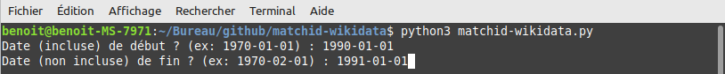

# matchid-wikidata
Import tool from deces.matchid.io list of french deceased persons to Wikidata

### Qu'est-ce que matchid-wikidata ?
matchid-wikidata est un outil d'importation qui facilite le renseignement des "Fichier des personnes décédées ID" <a href="https://www.wikidata.org/wiki/Property:P9058">P9058</a> du site https://deces.matchid.io sur Wikidata.

Il permet d'afficher sur une copie locale du décret :
* Les personnes existantes sur Wikidata qui sont susceptibles de correspondre aux personnes listées dans le décret.
* Des boutons pour ajouter sur Wikidata (via QuickStatement) la décoration attribuée par le décret.

 

---

### Utilisation
* Installez Python3 (gratuit).
* Installez jinja2 (gratuit).
* Téléchargez matchid-wikidata (bouton vert "Code" en haut à droite et "Download ZIP") et dézippez-le.
* Ouvrez un terminal (invite de commande) dans le dossier (Par exemple ``cd C:/xxx/xxx``).
* Lancez le programme avec la commande ``python3 matchid-wikidata``.
* Renseignez les quelques questions posées.
* Attendez... (Comptez ~45 minutes pour 500 personnes).
* Ouvrez out.html :
** Les lignes blanches sont les personnes déjà listées sur Wikidata et qui n'ont pas encore d'id matchid.
** Les lignes oranges sont les personnes sur matchid qui peuvent potentiellement correspondre.
* Si la personne correspond (<b>Attention aux homonymes ! Veillez à avoir un esprit critique</b>), cliquez sur le bouton correspondant. Note : Aucune donnée n'est envoyée à Wikidata.
* Allez tout en bas du fichier out.html pour récupérer le texte qui sera à importer dans QuickStatements (outil d'import rapide pour Wikidata).
---

### Bug
Vous pouvez signaler les bugs dans l'onglet Issue ou me laisser un message sur ma page wikidata https://www.wikidata.org/wiki/User:Sovxx
